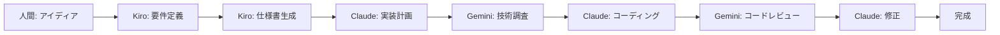

# 🔺 New-triforce-dev Framework 🔺

**Kiro × Claude Code × Gemini CLI = 完全自動化されたAI開発**

人間はアイディアを提示するだけ。3つのAIが協力して、要件定義から実装、検証まで全てを自動化する次世代開発フレームワークです。

## ✨ 特徴

- **🎯 人間の介入を最小化**: アイディアの提示のみで、AIが開発プロセス全体を管理
- **📋 スペック駆動開発**: Kiroが要件を整理し、明確な仕様書を自動生成
- **⚡ 高速実装**: Claude Codeが仕様書に基づいて正確にコーディング
- **🔍 自動検証**: Gemini CLIがWeb検索を活用して技術検証とレビューを実施
- **💰 無料枠最適化**: 各AIの無料枠を最大限活用する賢い役割分担

## 🤖 3つのAIの役割

|AI             |役割 |得意分野                 |無料枠      |
|---------------|---|---------------------|---------|
|**Amazon Kiro**|建築家|要件定義、仕様書作成、設計        |月50回     |
|**Claude Code**|実装者|コーディング、リファクタリング、Git操作|Max40回/5h|
|**Gemini CLI** |検証者|技術調査、Web検索、コードレビュー   |1000回/日  |

## 🚀 クイックスタート

### 1. 前提条件

- Node.js 20以上
- Docker Desktop（Dev Container使用時）
- Windows/Mac/Linux環境

### 2. セットアップ

```bash
# リポジトリをクローン
git clone https://github.com/turnDeep/new-triforce-dev.git
cd new-triforce-dev

# Dev Containerで開く（推奨）
# VS Codeで「Reopen in Container」を選択

# または手動セットアップ
npm install -g @anthropic-ai/claude-code @google/gemini-cli
make setup
```

### 3. Kiroのセットアップ（別途必要）

Kiroはデスクトップアプリのため、別途インストールが必要です：

1. [Kiro公式サイト](https://kiro.dev/)からダウンロード
1. インストール後、Google/GitHub/AWS SSOでログイン
1. `.kiro/KIRO.md`をKiroプロジェクトにコピー

### 4. 初回認証

```bash
# Claude Code認証
claude
# → ブラウザでAnthropicアカウントにログイン

# Gemini CLI認証
gemini
# → Googleアカウントでログイン
```

### 5. 開発開始！

```bash
# Kiroで要件定義（Kiro IDE内で実行）
"ユーザー認証システムを作りたい"

# 生成された仕様書をプロジェクトに同期
make sync-spec

# Claude Codeで実装
claude
> /project:implement-spec

# 自動的にGeminiが検証・レビュー
```

## 📊 開発フロー



## 🛠️ 主要コマンド

```bash
# 基本コマンド
make help          # ヘルプ表示
make setup         # 初期セットアップ
make dev           # 開発サーバー起動
make test          # テスト実行

# AI連携コマンド
make sync-spec     # Kiroの仕様書を同期
make implement     # 仕様書から実装
make verify        # Geminiで検証
make review        # コードレビュー
```

## 📁 プロジェクト構造

```
new-triforce-dev/
├── KIRO.md         # Kiroの行動規範
├── CLAUDE.md       # Claude Codeの行動規範
├── GEMINI.md       # Gemini CLIの行動規範
├── .kiro/          # Kiro関連ファイル
├── scripts/        # AI連携スクリプト
└── docs/           # 詳細ドキュメント
```

## 💡 使用例

### 例1: TODO管理アプリ

```bash
# Kiroで要件定義
"タスク管理ができるWebアプリを作りたい。
優先度設定、期限管理、カテゴリ分けができるように。"

# 自動的に以下が生成される：
# - ユーザーストーリー
# - データモデル設計
# - API仕様
# - 実装タスクリスト
```

### 例2: リアルタイムチャット

```bash
# より複雑な要件も処理可能
"WebSocketを使ったリアルタイムチャットアプリ。
複数ルーム、メンション機能、絵文字リアクション付き。"
```

## 🔧 カスタマイズ

- **KIRO.md**: プロジェクト固有の要件定義ルール
- **CLAUDE.md**: コーディング規約、技術スタック
- **GEMINI.md**: レビュー基準、検証項目
- **CODING_STANDARDS.md**: 統一コーディング規約

## ⚠️ 注意事項

- Kiroは月50回の制限があるため、要件定義は慎重に
- Claude Codeは5時間で40回までなので、効率的な実装を心がける
- Geminiは1日1000回と余裕があるため、検証は積極的に活用

## 🤝 貢献

このフレームワークは実験的プロジェクトです。改善提案、バグ報告、プルリクエストを歓迎します！

## 📜 ライセンス

MIT License - 詳細は<LICENSE>を参照

-----

**🎯 目標**: 人間の創造性とAIの実装力を組み合わせ、アイディアを最速で形にする