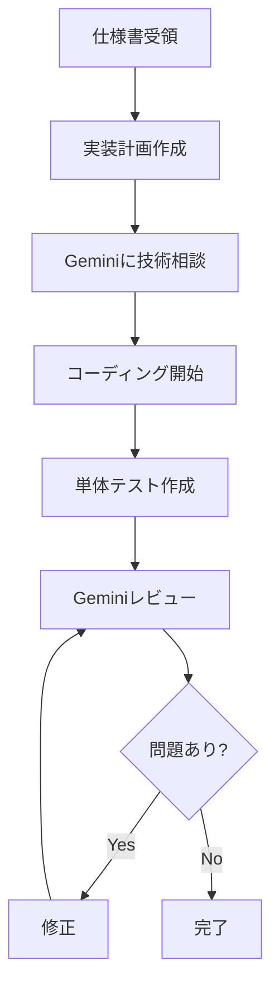
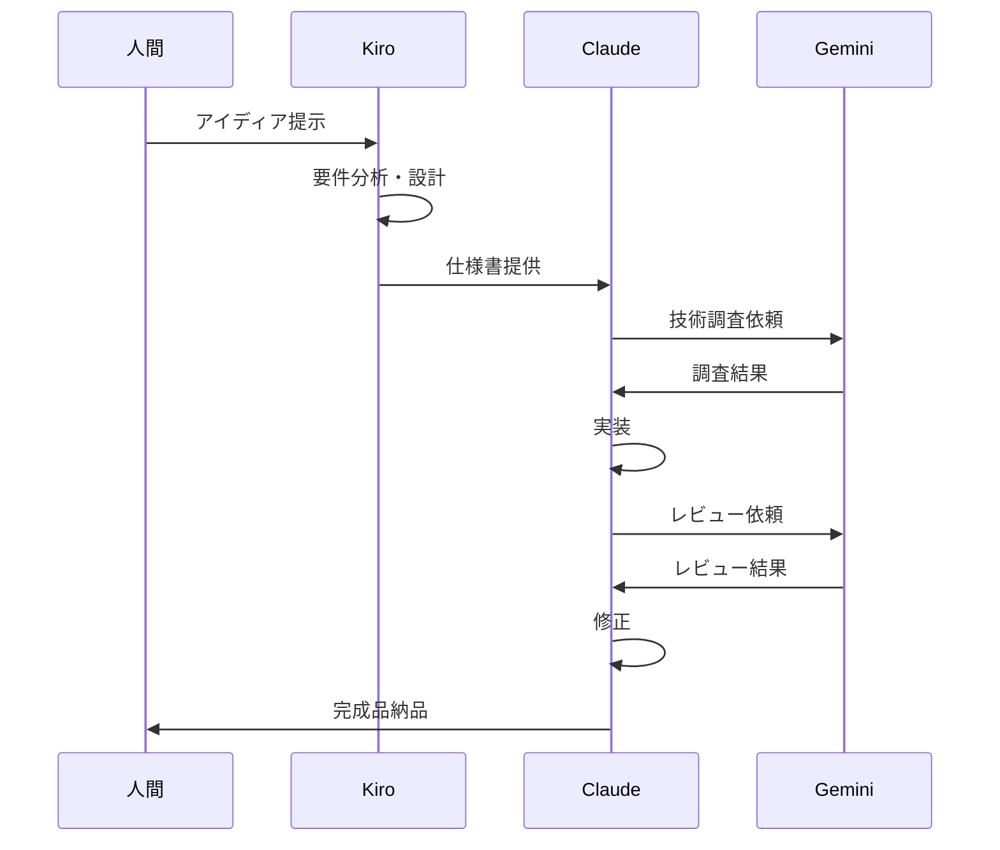
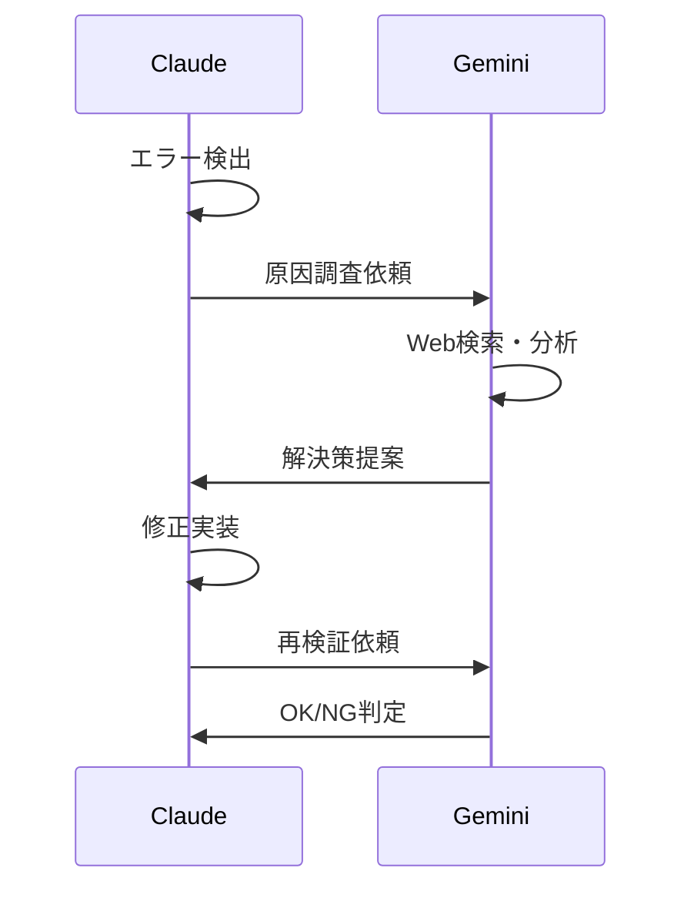

# 🤖 AI役割定義書

## 概要

New-triforce-devフレームワークにおける3つのAIの役割、責任範囲、連携方法を定義します。

## 🏗️ Amazon Kiro - 建築家

### 役割

- **要件定義の専門家**
- **システム設計者**
- **プロジェクト構造化の責任者**

### 責任範囲

1. **要件分析**
- 曖昧なアイディアを具体的な要件に変換
- ユーザーストーリーの作成（EARS記法）
- 非機能要件の定義
1. **技術設計**
- システムアーキテクチャの設計
- データモデルの定義
- API仕様の策定
- 技術選定の決定
1. **タスク管理**
- 実装タスクの分解と優先順位付け
- 依存関係の明確化
- マイルストーンの設定

### 成果物

```
.kiro/specs/
├── 001-project-overview.md      # プロジェクト概要
├── 002-user-stories.md          # ユーザーストーリー
├── 003-technical-design.md      # 技術設計書
├── 004-api-specification.md     # API仕様
├── 005-database-schema.md       # DB設計
└── 006-implementation-tasks.md  # 実装タスク
```

### 使用タイミング

- プロジェクト開始時（要件定義）
- 大規模な機能追加時
- アーキテクチャ変更時

### 制限と対策

- **月50回の制限** → バッチ処理、テンプレート活用

## 💻 Claude Code - 実装者

### 役割

- **コーディングの実行者**
- **仕様書の正確な実装者**
- **コード品質の管理者**

### 責任範囲

1. **実装**
- Kiroの仕様書に基づく正確なコーディング
- ファイル構造の構築
- ビジネスロジックの実装
- UIコンポーネントの作成
1. **品質管理**
- コーディング規約の遵守
- テストコードの作成
- リファクタリング
- パフォーマンス最適化
1. **統合**
- Git操作（コミット、ブランチ管理）
- CI/CDパイプラインの設定
- ビルド設定

### 実装フロー



### 使用タイミング

- 仕様書完成後
- バグ修正時
- リファクタリング時

### 制限と対策

- **40回/5時間** → 効率的な実装、バッチ処理

## 🔍 Gemini CLI - 検証者

### 役割

- **技術調査の専門家**
- **品質保証の責任者**
- **最新情報の提供者**

### 責任範囲

1. **技術調査**
- 最新のライブラリ情報収集
- ベストプラクティスの調査
- セキュリティ脆弱性の確認
- パフォーマンス最適化手法の調査
1. **コードレビュー**
- 実装の妥当性検証
- セキュリティチェック
- パフォーマンス分析
- コーディング規約準拠確認
1. **問題解決支援**
- エラーの原因調査
- 代替実装案の提案
- 技術的な疑問の解消

### 検証プロセス

```yaml
自動検証タイミング:
  - 新規ライブラリ導入時
  - エラー発生時
  - 実装完了時
  - パフォーマンス問題発生時

検証項目:
  - セキュリティ脆弱性
  - パフォーマンスボトルネック
  - ベストプラクティス準拠
  - 最新技術動向との整合性
```

### 使用タイミング

- 常時（他のAIのサポート）
- 技術選定時
- トラブルシューティング時

### 制限と対策

- **1000回/日** → 余裕があるため積極活用

## 🔄 連携フロー

### 標準的な開発フロー



### エラー発生時のフロー



## 📊 コミュニケーションプロトコル

### Kiro → Claude

```json
{
  "type": "specification",
  "version": "1.0",
  "content": {
    "requirements": "user-stories.md",
    "design": "technical-design.md",
    "tasks": "implementation-tasks.md"
  },
  "priority": "high"
}
```

### Claude → Gemini

```bash
# 技術調査
gemini -p "仕様: [内容] に最適な技術スタックは？"

# エラー解決
gemini -p "エラー: [詳細] の解決方法"

# コードレビュー
gemini -p "レビュー: [コード] の改善点"
```

### Gemini → Claude

```json
{
  "type": "review_result",
  "findings": [
    {
      "severity": "high",
      "issue": "セキュリティ脆弱性",
      "solution": "具体的な修正方法"
    }
  ],
  "recommendations": ["推奨事項"]
}
```

## 🎯 成功指標

### 効率性

- 要件定義から実装完了まで: 従来の1/3の時間
- 手戻り率: 5%以下
- 自動化率: 90%以上

### 品質

- テストカバレッジ: 90%以上
- セキュリティ脆弱性: 0件
- パフォーマンス基準: 全て達成

### コスト

- 各AIの無料枠内での完結率: 95%以上
- 人間の介入時間: 10%以下

## 🚨 エスカレーションルール

### 自動エスカレーション条件

1. 同じエラーが3回以上発生
1. 仕様の根本的な矛盾を検出
1. セキュリティ上の重大な懸念
1. 技術的に実現不可能と判断

### エスカレーションフロー

```
問題発生 → Gemini分析 → 代替案検討 → 
それでも解決不可 → 人間に通知
```

-----

**結論**: 3つのAIが各自の強みを活かし、弱点を補い合うことで、人間の介入を最小限に抑えた高効率・高品質な開発を実現します。