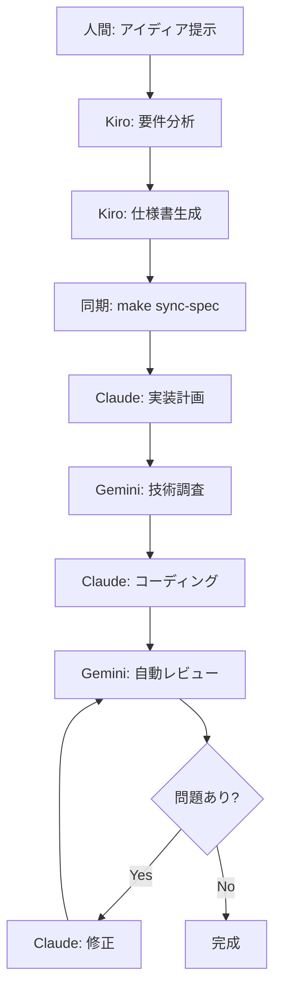
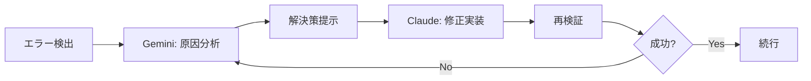

# 🔄 新三位一体開発ワークフロー

## 概要

New-triforce-devにおける開発ワークフローは、人間の介入を最小限に抑え、3つのAIが協調して開発を進める設計になっています。

## 🎯 基本的な開発フロー



## 📚 詳細なワークフロー

### 1. プロジェクト開始（人間 → Kiro）

#### 1.1 アイディアの提示

```bash
# Kiro IDEで新規プロジェクトを開始
"ECサイトに商品レビュー機能を追加したい。
5つ星評価、コメント、画像アップロード対応で。"
```

#### 1.2 Kiroによる仕様書生成

Kiroは以下を自動生成：

- プロジェクト概要
- ユーザーストーリー（EARS記法）
- 技術設計書
- API仕様
- データベース設計
- 実装タスクリスト

### 2. 仕様同期（Kiro → Claude）

#### 2.1 仕様書の同期

```bash
# ターミナルで実行
make sync-spec
```

これにより以下が自動実行：

- 型定義の生成 (`src/types/generated.types.ts`)
- APIスタブの生成 (`src/api/`)
- タスクリストの生成 (`TASKS.md`)

### 3. 実装フェーズ（Claude + Gemini）

#### 3.1 Claude Codeの起動

```bash
claude
> /project:implement-spec
```

#### 3.2 自動実装プロセス

Claude Codeは以下を自動的に実行：

1. **技術スタック確認**（Geminiに自動相談）
   
   ```
   → 最新のライブラリバージョン確認
   → セキュリティ脆弱性チェック
   → ベストプラクティス確認
   ```
1. **段階的実装**
   
   ```
   フェーズ1: 基盤構築
   → プロジェクト設定
   → フォルダ構造作成
   → 基本設定ファイル
   
   フェーズ2: コア機能
   → モデル定義
   → API実装
   → ビジネスロジック
   
   フェーズ3: UI実装
   → コンポーネント作成
   → ページ実装
   → スタイリング
   ```
1. **継続的検証**（各ステップでGeminiが自動チェック）
   
   ```
   → コーディング規約準拠
   → セキュリティチェック
   → パフォーマンス確認
   ```

### 4. 品質保証フェーズ（Gemini主導）

#### 4.1 自動コードレビュー

```bash
make review
```

Geminiが以下を自動チェック：

- セキュリティ脆弱性
- パフォーマンスボトルネック
- コーディング規約違反
- ベストプラクティス準拠

#### 4.2 包括的検証

```bash
make verify
```

実行される検証：

- ユニットテスト
- 型チェック
- リンター
- カバレッジ測定

### 5. 完成・納品

#### 5.1 最終チェック

```bash
npm run validate:full
```

生成される成果物：

- `validation-report.json` - 検証レポート
- 動作するアプリケーション
- 完全なテストスイート
- ドキュメント

## 🔧 特殊なワークフロー

### エラー発生時の自動対応



### パフォーマンス問題の自動解決

1. **問題検出**: ビルド時間やレスポンスタイムの閾値超過
1. **分析**: Geminiがボトルネックを特定
1. **最適化**: Claudeが自動的に最適化実装
1. **検証**: 改善効果を測定

## 📋 タスク管理

### タスクの自動追跡

- `.kiro/specs/latest/implementation.meta.json` - 実装メタデータ
- `TASKS.md` - 人間が読めるタスクリスト
- Git コミットによる進捗記録

### 進捗の可視化

```bash
# 現在の進捗を確認
cat TASKS.md | grep -E "\\[x\\]|\\[ \\]" | wc -l
```

## 🚀 高度な機能

### 1. 並列開発

複数の機能を同時開発する場合：

```bash
# 機能A
make init-kiro "ユーザープロフィール機能"

# 機能B（別ターミナル）
make init-kiro "通知システム"
```

### 2. 継続的改善

```bash
# 定期的な品質チェック
*/4 * * * * cd /project && make verify > /dev/null 2>&1
```

### 3. 自動最適化

Claudeが定期的に以下を実行：

- 未使用コードの削除
- インポートの最適化
- パフォーマンス改善

## 💡 ベストプラクティス

### 1. 要件定義のコツ

- **具体的に**: 「速い」ではなく「初期ロード3秒以内」
- **測定可能に**: 成功条件を数値化
- **優先順位明確に**: MVPと将来機能を分離

### 2. 効率的な実装

- **バッチ処理**: 関連機能はまとめて要件定義
- **段階的リリース**: 大きな機能は分割
- **早期検証**: 各フェーズで動作確認

### 3. トラブル回避

- **仕様の明確化**: 曖昧さを排除
- **制約の明記**: 技術的制限を事前に定義
- **定期的な検証**: `make verify`を頻繁に実行

## 🔍 デバッグとトラブルシューティング

### ログの確認

```bash
# Kiroのログ
cat .kiro/logs/latest.log

# 検証レポート
cat validation-report.json

# Git履歴
git log --oneline
```

### 一般的な問題と解決策

1. **仕様書が生成されない**
- Kiro IDEが正しく設定されているか確認
- `.kiro/specs/`ディレクトリの権限確認
1. **実装が仕様と異なる**
- `make sync-spec`を再実行
- `.kiro/specs/latest/`が正しいか確認
1. **テストが失敗する**
- `npm test -- --verbose`で詳細確認
- Geminiに自動修正を依頼

## 📊 メトリクスとKPI

### 開発効率

- 要件定義→実装完了: 目標8時間以内
- 手戻り率: 5%以下
- 自動化率: 90%以上

### 品質指標

- テストカバレッジ: 90%以上
- 型カバレッジ: 100%
- Lighthouseスコア: 95以上

### AIリソース使用

- Kiro: 月50回以内
- Claude Code: 5時間40回以内
- Gemini CLI: 日1000回以内

-----

**このワークフローに従うことで、人間の介入を最小限に抑えながら、高品質なソフトウェアを高速に開発できます。**